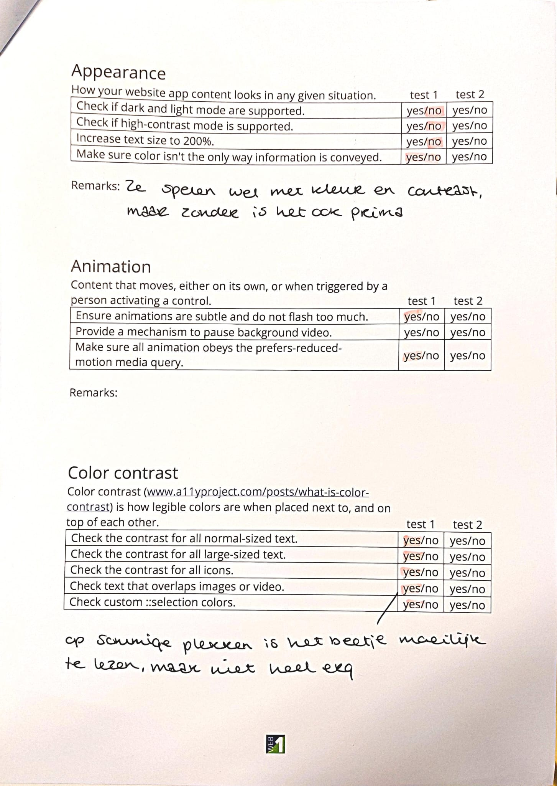
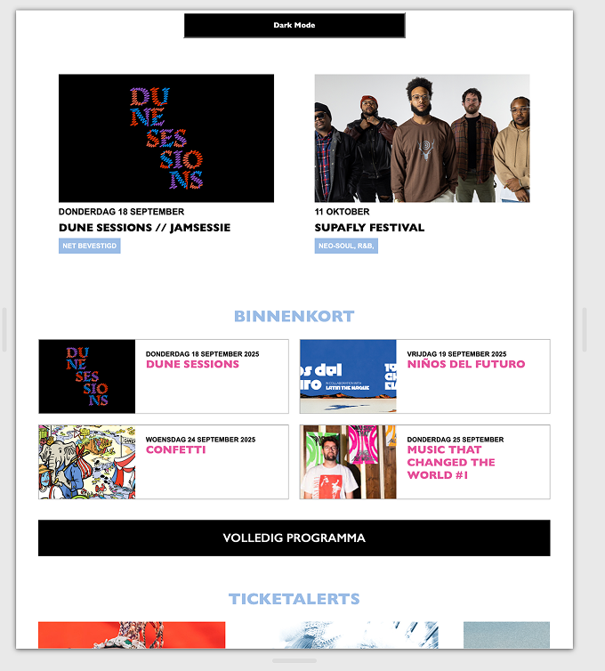

# Procesverslag
Markdown is een simpele manier om HTML te schrijven.  
Markdown cheat cheet: [Hulp bij het schrijven van Markdown](https://github.com/adam-p/markdown-here/wiki/Markdown-Cheatsheet).

Nb. De standaardstructuur en de spartaanse opmaak van de README.md zijn helemaal prima. Het gaat om de inhoud van je procesverslag. Besteedt de tijd voor pracht en praal aan je website.

Nb. Door *open* toe te voegen aan een *details* element kun je deze standaard open zetten. Fijn om dat steeds voor de relevante stuk(ken) te doen.

## Jij

  
uitwerken voor kick-off werkgroep

  ### Auteur:
  Enia Turohan

  #### Je startniveau:
  blauw

  #### Je focus:
  responsive
 

## Je website

  

  Debrief
  Voor dit project moest je een bestaande website uitkiezen en daarvan twee verschillende pagina’s namaken met je eigen HTML en CSS. Tijdens de lessen hebben we allerlei technieken geleerd die hierbij helpen, zoals het werken met flexbox, het indelen van content in kolommen en het toevoegen van animaties. Daarnaast hebben we ons verdiept in het maken van websites die niet alleen mooi zijn, maar ook goed werken op verschillende schermformaten (responsiveness) en voor iedereen toegankelijk zijn (toegankelijkheid).
  Tot slot moest je een richting kiezen die jouw hoofdfocus werd tijdens het project, namelijk responsivensess en toegankelijkheid.
  

  ### Je opdracht:
  https://www.paard.nl

  #### Screenshot(s) van de eerste pagina (small screen): 
  HOME pagina  
  

  #### Screenshot(s) van de tweede pagina (small screen):
  FOTOVERSLAGEN pagina  
  
 

## Toegankelijkheidstest 1/2 (week 1)

  

  
  
  
  
  
  e werkgroep

  ### Bevindingen
  Ik kwam erachter dat de website van PAARD een beetje outdated was en wel wat vernieuwingen kan gebruiken, wat betreft toegankelijkheid. Maar dit was ook wel een leuke challenge voor mezelf, dat ik dan die vernieuwingen eventueel kon brengen. Later koos ik wel uiteindelijk voor responsive als focus, maar ik vond het wel interessant om te leren wat er allemaal achter schuilt soortvan.

## Breakdownschets (week 1)

  
uitwerken na afloop 3e werkgroep

  ### de hele pagina: 
  
  
  
  

  ### tweede pagina: 
  

## Voortgang 1 (week 2)

  
uitwerken voor 1e voortgang

  ### Stand van zaken
  Ik ben al goed op weg sinds mn breakdownschetsen. Al mn basishtml staat er al en de basis css ook. Nu moet ik alles nog verbeteren volgens de juiste codes die we in de les hebben behandeld. 

  ### Agenda voor meeting
  samen met je groepje opstellen

  Iedereen is benieuwd over de hamburgermenu, dus dat willen we bespreken hoe je dat het beste kan doen.

  ### Verslag van meeting
  hier na afloop snel de uitkomsten van de meeting vastleggen

  - Ik ga mn css met nth of type etc opnieuw herschrijven
  - Ik ga goed kijken wanneer ik flexbox moet gebruiken en wanneer de grid.
  - Ik ga mn 3 css bestanden samenvoegen in 1 css bestand.
  - ...

## Voortgang 2 (week 3)

  
uitwerken voor 2e voortgang

  ### Stand van zaken
  Ik ben goed op schema en mn basis is zo goed als af. Nu moet ik focussen op het interactief maken van mn website, omdat het nu een beetje plat en 2D is. Dit kan ik doen met animaties en hover effecten etc.

  ### Agenda voor meeting
  samen met je groepje opstellen

  Sommigen hebben een carousel in hun website en zijn benieuwd hoe je dit moet doen.
  Ik had het toevallig al uitgevogeld hihi 

  ### Verslag van meeting
  hier na afloop snel de uitkomsten van de meeting vastleggen

  - Ik ga hover toevoegen aan mn articles
  - Ik ga animaties toevoegen
  - Ik ga een geheime party knop toevoegen
- ...

## Toegankelijkheidstest 2/2 (week 4)

  
uitwerken na test in 9e werkgroep

  ### Bevindingen
  Bijna alles bleeft hetzelfde, maar dit us wat anders was.
  - Die van mij had geen errors bij W3C validation en die van PAARD zelf wel.
  - Het filmpje op mn site heeft wel ondertiteling, maar het klopt niet ofzo.
  - Ik heb button-element gebruikt waar nodig. (Wanneer er Javascript bij hoort)
  - Ik heb een dark mode-knop toegevoegd die ook werkt op beide pagina's.

## Voortgang 3 (week 4)

  
uitwerken voor 3e voortgang

  ### Stand van zaken
  Ik ben in principe klaar en heb m'n hover en animaties laten zien. Wel struggle ik nog steeds met de hamburger menu.

  ### Agenda voor meeting
  samen met je groepje opstellen

  Iedereen wil gewoon even hun website laten zien om te zien of alles er een beetje goed uitziet en werkt.

  ### Verslag van meeting
  hier na afloop snel de uitkomsten van de meeting vastleggen

  - Hamburger menu uitvogelen.
  - Laatste deeltjes responsive maken.
  - Nog even strijden.
  - ...

## Eindgesprek (week 5)

  
uitwerken voor eindgesprek

  ### Je uitkomst - karakteristiek screenshots:
  
   
    

  ### Dit ging goed/Heb ik geleerd: 
  Korte omschrijving met plaatjes

  

  

  ### Dit was lastig/Is niet gelukt:
  Korte omschrijving met plaatjes

  

## Bronnenlijst

  
continu bijhouden terwijl je werkt

  Nb. Wees specifiek ('css-tricks' als bron is bijv. niet specifiek genoeg). 
  Nb. ChatGpT en andere AI horen er ook bij.
  Nb. Vermeld de bronnen ook in je code.

1. OpenAI. (2025). ChatGPT [AI-model]. Geraadpleegd op 1 oktober 2025, van https://chat.openai.com/
2. [CMD-FED]. (2025). Werkbladen en opdrachten [Lesmateriaal]. Hogeschool van Amsterdam.
3. PAARD. (z.d.). PAARD.nl. Geraadpleegd op 16 september 2025, van https://www.paard.nl/
4. PAARD. (z.d.). Afbeeldingen van PAARD.nl. Geraadpleegd op 16 september 2025, van https://www.paard.nl/

